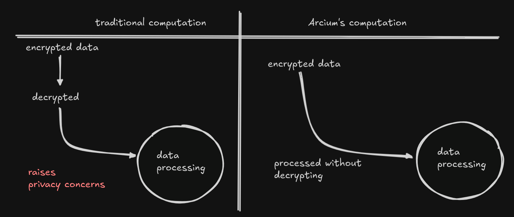

# Arcium Documentation

<strong>Example Applications You Can Build</strong>

### 1. Secure Portfolio Tracker
A privacy-preserving portfolio tracking application that allows users to monitor their crypto investments, share performance insights, and receive personalized recommendations without exposing their actual holdings or wallet addresses.

### 2. PrivateTip Platform
A Solana-based dApp that lets content creators receive private, on-chain tips from followers. Using Arcium's MPC encryption, supporters can send micro-payments or "tips" without revealing their identities or amounts, while creators transparently see their rewards.

> **Decrypting the [Arcium Developer Documentation](https://docs.arcium.com/developers)**

---

## What is Arcium?

Arcium is a **decentralized private computation network** that enables the processing of encrypted data without compromising privacy.

## The Problem It Solves

Arcium addresses the critical challenge of **processing sensitive data while maintaining complete privacy** throughout the computation process.

  

## What Arcium Enables for Solana Developers

Arcium empowers developers to:

- **Build privacy-preserving applications** on Solana
- **Use familiar tooling** (Arcius) built on Rust - an extended version of Anchor
- **Process sensitive data** without decryption, including trades, personal data, and balances

Arcium use cases that i can think of 

1. Secure Portfolio - a privacy-preserving portfolio tracking application that allows users to monitor their crypto investments, share performance insights, and receive personalized recommendations without exposing their actual holdings or wallet addresses.
2. PrivateTip - A Solana-based dApp that lets content creators receive private, on-chain tips from followers. Using Arcium’s MPC encryption, supporters can send micro-payments or “tips” without revealing their identities or amounts, while creators transparently see their rewards.

---

## Understanding MXE (Multi-Party eXecution Environments)

<strong>What are MXEs?</strong>

**Multi-Party eXecution Environments** are customizable environments where computational tasks are executed securely. Think of them as **virtual machines for Arcium's supercomputer**.

### Configurable Aspects

| Component | Description |
|-----------|-------------|
| **Authority** | Who is allowed to initiate an MXE |
| **Cluster** | What nodes are allowed and mandated to participate in the MXE |
| **Protocol** | The underlying cryptographic protocol used |
| **IOSchema** | Where input data comes from and where output data can be written |
| **Computation Definition** | What operations are allowed on the data in MXEs and how these operations are defined |

---

## How Arcium Works

The MXE processes encrypted data through a simple, secure workflow:

  

---

## Common Use Cases

### Private DeFi
Dark pools where trade sizes and prices are hidden, enabling truly permissionless confidential trading without front-running or market manipulation.

### Secure AI
AI model inference and training on sensitive data while keeping the data encrypted throughout the entire process.

### Confidential Gaming
Hidden information games where player moves and state remain private until revealed - perfect for card games, strategy games, and auctions.
