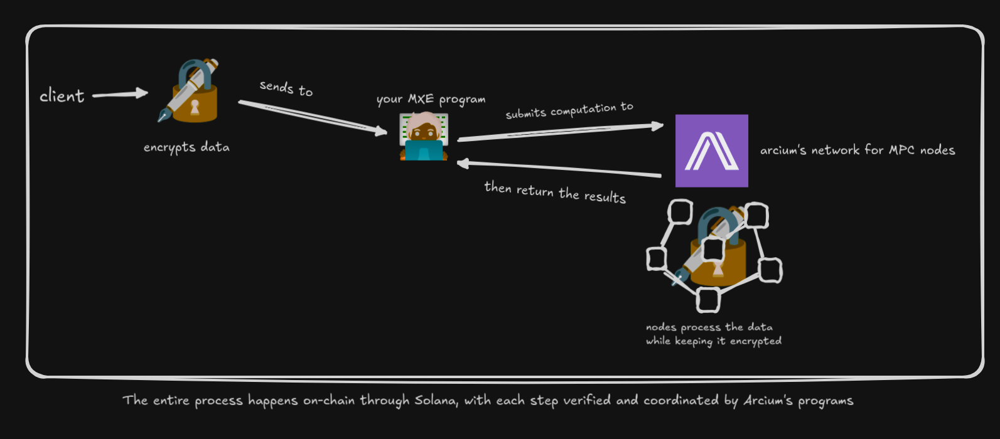

# arcium-docs-eli5

- decrypting [arcium dev](https://docs.arcium.com/developers) docs

### What is Arcium?
- a decentrlized private computation network that enables the processing of encrypted data

### What Problem does it solve?
- solves the problem of processing sensitive data while maintianing privacy

### What does Arcium enable for Solana developers?
→ Build a privacy-preserving application

→ use familiar tool (Arcius), built on Rust (extended version of Anchor)

→process sensitive data (without decrypting), i.e., trades, personal data, and balances, et,c is processed securely

Arcium use cases that i can think of 

1. Secure Portfolio - a privacy-preserving portfolio tracking application that allows users to monitor their crypto investments, share performance insights, and receive personalized recommendations without exposing their actual holdings or wallet addresses.
2. PrivateTip - A Solana-based dApp that lets content creators receive private, on-chain tips from followers. Using Arcium’s MPC encryption, supporters can send micro-payments or “tips” without revealing their identities or amounts, while creators transparently see their rewards.

 What is MXE? in short

- Multi-Party eXecution Environments --> customizable environments where computational tasks are executed securely
- are virtual machines for Arcium's supercomputer

MXEs are highly configurable, aspects that can be configured are
- Authority -> who is allowed to initiate an MXE
- Cluster -> what nodes are allowed and mandated to participate the MXE
- Protocol used
- IOSchema -> where input data comes and where output data can be written
- computation definition - what operations are allowed in the data in MXEs and how are these operations defined.

### How does Arcium Works?
the MXE works with encrypted data in simple steps:

### Common Use Cases of Arcium
- Private DeFi -> dark pools where trade sizes and prices are hidden, enabling truly permissionless confidential trading without front-running or market manipulation
- Secure AI -> AI model inference and training on sensitive data while keeping the data encrypted.
- Confidential Gaming: hidden information games where player moves and state remain private until revealed like card games, strategy games, auctions.